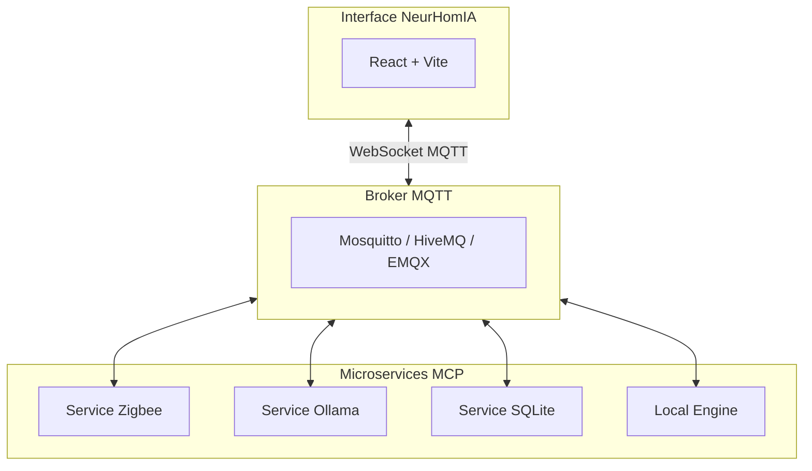
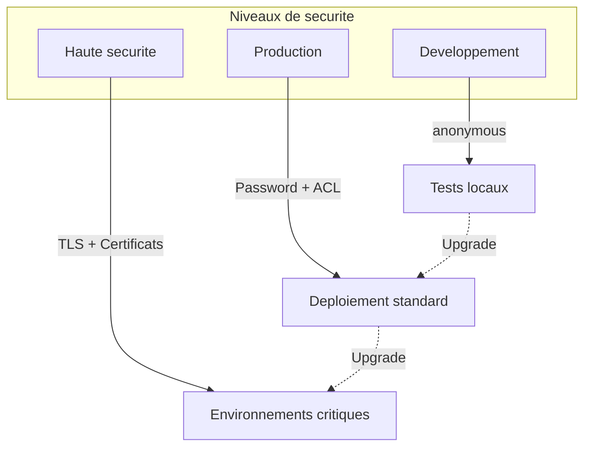
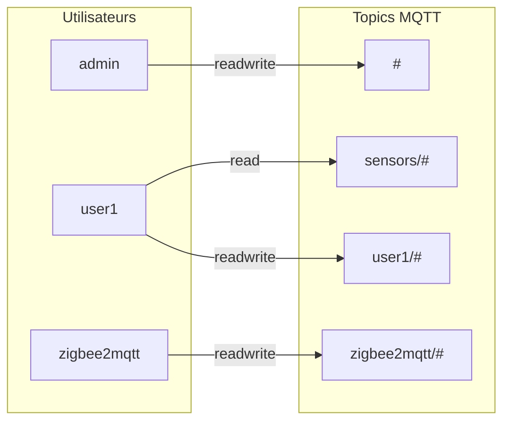
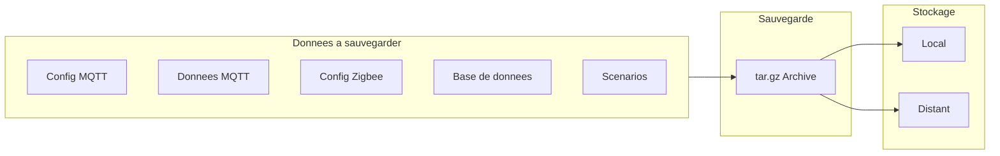

# Guide Administrateur NeurHomIA

> **Version** : 1.0.0 | **Mise à jour** : 2026-03-09T10:00:00

Guide complet pour l'administration et la configuration avancée de NeurHomIA.

## 🎯 Rôle de l'administrateur

L'administrateur NeurHomIA est responsable de :
- Configuration et maintenance du système
- Gestion des brokers MQTT et microservices
- Sécurité et contrôle d'accès
- Surveillance et dépannage
- Sauvegardes et restaurations

---

## 🏗️ Architecture système

### Vue d'ensemble



### Composants principaux

| Composant | Rôle | Port par défaut |
|-----------|------|-----------------|
| **NeurHomIA UI** | Interface utilisateur | 5173 |
| **Broker MQTT** | Bus de messages | 1883 / 9001 (WS) |
| **Local Engine** | Exécution des scénarios | 3001 |
| **Zigbee2MQTT** | Passerelle Zigbee | 8080 |
| **Ollama** | IA locale | 11434 |

---

## 🔧 Configuration MQTT

### Broker Mosquitto (recommandé)

#### Installation

```bash
# Docker
docker run -d --name mosquitto \
  -p 1883:1883 -p 9001:9001 \
  -v /path/to/mosquitto.conf:/mosquitto/config/mosquitto.conf \
  eclipse-mosquitto:2
```

#### Configuration (`mosquitto.conf`)

```conf
# Écoute TCP standard
listener 1883

# WebSocket pour l'interface web
listener 9001
protocol websockets

# Authentification
allow_anonymous false
password_file /mosquitto/config/passwd

# Persistence
persistence true
persistence_location /mosquitto/data/

# Logging
log_dest file /mosquitto/log/mosquitto.log
log_type all
```

#### Création d'utilisateurs

```bash
docker exec -it mosquitto mosquitto_passwd -c /mosquitto/config/passwd admin
docker exec -it mosquitto mosquitto_passwd /mosquitto/config/passwd user1
```

### Configuration dans NeurHomIA

1. Accédez à **Configuration > MQTT**
2. Renseignez les paramètres :
   - **Hôte** : `localhost` ou IP du serveur
   - **Port** : `9001` (WebSocket)
   - **Utilisateur** : nom d'utilisateur MQTT
   - **Mot de passe** : mot de passe MQTT
3. Cliquez sur **Tester la connexion**
4. **Enregistrez** si le test réussit

---

## 🐳 Gestion des conteneurs Docker

### docker-compose.yml recommandé

```yaml
version: '3.8'

services:
  mosquitto:
    image: eclipse-mosquitto:2
    container_name: neurhomia-mqtt
    ports:
      - "1883:1883"
      - "9001:9001"
    volumes:
      - ./mosquitto/config:/mosquitto/config
      - ./mosquitto/data:/mosquitto/data
      - ./mosquitto/log:/mosquitto/log
    restart: unless-stopped

  zigbee2mqtt:
    image: koenkk/zigbee2mqtt
    container_name: neurhomia-zigbee
    depends_on:
      - mosquitto
    environment:
      - TZ=Europe/Paris
    volumes:
      - ./zigbee2mqtt/data:/app/data
      - /run/udev:/run/udev:ro
    devices:
      - /dev/ttyUSB0:/dev/ttyUSB0
    restart: unless-stopped

  ollama:
    image: ollama/ollama
    container_name: neurhomia-ollama
    ports:
      - "11434:11434"
    volumes:
      - ./ollama:/root/.ollama
    restart: unless-stopped

  local-engine:
    build: ./local-engine
    container_name: neurhomia-engine
    depends_on:
      - mosquitto
    environment:
      - MQTT_HOST=mosquitto
      - MQTT_PORT=1883
    restart: unless-stopped
```

### Commandes utiles

```bash
# Démarrer tous les services
docker-compose up -d

# Voir les logs
docker-compose logs -f

# Redémarrer un service
docker-compose restart zigbee2mqtt

# Mise à jour des images
docker-compose pull
docker-compose up -d
```

---

## 🔐 Sécurité

### Authentification MQTT



#### Niveaux de sécurité

| Niveau | Configuration | Usage |
|--------|--------------|-------|
| **Développement** | `allow_anonymous true` | Tests locaux uniquement |
| **Production** | Mot de passe + ACL | Déploiement standard |
| **Haute sécurité** | TLS + certificats clients | Environnements critiques |

#### Configuration TLS

```conf
# mosquitto.conf avec TLS
listener 8883
cafile /mosquitto/certs/ca.crt
certfile /mosquitto/certs/server.crt
keyfile /mosquitto/certs/server.key
require_certificate true
```

### Contrôle d'accès (ACL)



```conf
# acl.conf
# Admin - accès complet
user admin
topic readwrite #

# Utilisateur standard - lecture seule sur les capteurs
user user1
topic read sensors/#
topic readwrite user1/#

# Service Zigbee - accès Zigbee uniquement
user zigbee2mqtt
topic readwrite zigbee2mqtt/#
```

### Bonnes pratiques

1. **Ne jamais utiliser** `allow_anonymous true` en production
2. **Changer les mots de passe par défaut** dès l'installation
3. **Utiliser TLS** pour les connexions distantes
4. **Limiter les ACL** au strict nécessaire
5. **Surveiller les logs** pour détecter les intrusions

---

## 📊 Monitoring et surveillance

### Tableau de bord administrateur

Accédez à **Configuration > Monitoring** pour :
- État des connexions MQTT
- Statistiques de messages (reçus/envoyés)
- Latence et performances
- Services actifs/inactifs

### Logs système

#### Niveaux de log

| Niveau | Description | Quand l'utiliser |
|--------|-------------|------------------|
| `DEBUG` | Très détaillé | Développement/dépannage |
| `INFO` | Informations générales | Production normale |
| `WARN` | Avertissements | Anomalies non bloquantes |
| `ERROR` | Erreurs | Problèmes à investiguer |

#### Accès aux logs

```bash
# Logs du broker MQTT
docker logs -f neurhomia-mqtt

# Logs de tous les services
docker-compose logs -f --tail=100

# Filtrer par niveau
docker-compose logs | grep -i error
```

### Alertes automatiques

Configurez des alertes dans **Configuration > Alertes** :
- Déconnexion d'un service
- Espace disque faible
- Temps de réponse dégradé
- Erreurs répétées

---

## 💾 Sauvegardes et restauration

### Stratégie de sauvegarde



### Éléments à sauvegarder

| Élément | Chemin | Fréquence recommandée |
|---------|--------|----------------------|
| Configuration MQTT | `./mosquitto/config/` | Après modification |
| Données persistantes | `./mosquitto/data/` | Quotidien |
| Configuration Zigbee | `./zigbee2mqtt/data/` | Après ajout d'appareil |
| Base de données | `./data/neurhomia.db` | Quotidien |
| Scénarios | Export JSON | Après modification |

### Script de sauvegarde

```bash
#!/bin/bash
# backup.sh
BACKUP_DIR="/backups/neurhomia"
DATE=$(date +%Y%m%d_%H%M%S)

mkdir -p $BACKUP_DIR

# Arrêter les services pour cohérence
docker-compose stop

# Sauvegarder
tar -czf $BACKUP_DIR/neurhomia_$DATE.tar.gz \
  ./mosquitto \
  ./zigbee2mqtt/data \
  ./data

# Redémarrer
docker-compose start

# Rotation (garder 7 jours)
find $BACKUP_DIR -name "*.tar.gz" -mtime +7 -delete

echo "Sauvegarde terminée : $BACKUP_DIR/neurhomia_$DATE.tar.gz"
```

### Restauration

```bash
#!/bin/bash
# restore.sh
BACKUP_FILE=$1

docker-compose down
tar -xzf $BACKUP_FILE -C ./
docker-compose up -d

echo "Restauration terminée"
```

---

## 🔄 Mise à jour

### Procédure de mise à jour

1. **Sauvegarder** la configuration actuelle
2. **Arrêter** les services : `docker-compose down`
3. **Mettre à jour** les images : `docker-compose pull`
4. **Redémarrer** : `docker-compose up -d`
5. **Vérifier** le fonctionnement

### Mise à jour automatique avec Watchtower

```yaml
# Ajouter dans docker-compose.yml
watchtower:
  image: containrrr/watchtower
  volumes:
    - /var/run/docker.sock:/var/run/docker.sock
  environment:
    - WATCHTOWER_CLEANUP=true
    - WATCHTOWER_SCHEDULE=0 0 4 * * *  # 4h du matin
  restart: unless-stopped
```

---

## 🛠️ Dépannage

### Problèmes fréquents

#### Le broker MQTT ne démarre pas

```bash
# Vérifier les logs
docker logs neurhomia-mqtt

# Causes courantes :
# - Port 1883 déjà utilisé
# - Erreur de syntaxe dans mosquitto.conf
# - Permissions sur les fichiers de config
```

#### Les appareils Zigbee ne sont pas détectés

1. Vérifier que le coordinateur est bien connecté : `ls -la /dev/ttyUSB*`
2. Vérifier les permissions : `sudo usermod -aG dialout $USER`
3. Redémarrer Zigbee2MQTT : `docker-compose restart zigbee2mqtt`

#### L'interface ne se connecte pas au MQTT

1. Vérifier que le port WebSocket (9001) est ouvert
2. Tester avec un client MQTT externe (MQTT Explorer)
3. Vérifier les identifiants dans **Configuration > MQTT**

### Diagnostic réseau

```bash
# Test de connectivité MQTT
mosquitto_pub -h localhost -p 1883 -t "test" -m "hello" -u admin -P password

# Test WebSocket
wscat -c ws://localhost:9001

# Scan des ports ouverts
netstat -tlnp | grep -E "1883|9001"
```

### Réinitialisation d'urgence

En cas de problème majeur :

```bash
# Sauvegarde d'urgence
cp -r ./data ./data.backup.emergency

# Réinitialisation complète
docker-compose down -v
docker-compose up -d

# Restaurer la configuration depuis la sauvegarde si nécessaire
```

---

## 📋 Checklist de déploiement

### Avant la mise en production

- [ ] Mots de passe changés (tous les services)
- [ ] TLS configuré pour les connexions distantes
- [ ] ACL configurées et testées
- [ ] Sauvegardes automatiques configurées
- [ ] Alertes configurées
- [ ] Documentation des accès mise à jour
- [ ] Tests de restauration effectués

### Maintenance régulière

- [ ] **Quotidien** : Vérification des alertes
- [ ] **Hebdomadaire** : Revue des logs d'erreur
- [ ] **Mensuel** : Test de restauration de sauvegarde
- [ ] **Trimestriel** : Mise à jour des services
- [ ] **Annuel** : Revue de sécurité complète

---

## 📞 Support

### Ressources

- **Documentation technique** : Voir les guides Architecture et SDK
- **Logs de diagnostic** : `docker-compose logs`
- **Communauté** : Forum et Discord NeurHomIA

### Escalade

Pour les problèmes non résolus :
1. Collecter les logs pertinents
2. Documenter les étapes de reproduction
3. Contacter le support technique

---

*Guide Administrateur NeurHomIA - Pour une infrastructure domotique robuste et sécurisée*
