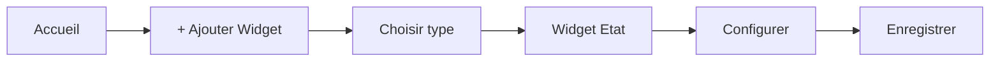

# Guide de démarrage rapide NeurHomIA

> **Version** : 1.0.0 | **Mise à jour** : 2026-03-09T10:00:00

🚀 **Démarrez avec NeurHomIA en moins de 10 minutes !**

---

## ⚡ Installation express

### 1. Prérequis
- **Docker** et **Docker Compose** installés
- Port **1883** (MQTT) et **9001** (WebSocket) disponibles

### 2. Démarrage en 3 commandes
```bash
# Cloner et démarrer
git clone https://github.com/neurhome-ia/neurhomia
cd neurhomia && docker-compose up -d

# Vérifier que tout fonctionne
docker-compose ps
```

✅ **Interface accessible** : [http://localhost:5173](http://localhost:5173)

---

## 🎯 Configuration de base (2 minutes)

### Étape 1 : Connexion MQTT
1. Allez dans **⚙️ Configuration > MQTT**
2. Paramètres par défaut :
   - **Hôte** : `localhost`
   - **Port** : `9001`
   - **Utilisateur** : `admin`
   - **Mot de passe** : `neurhomia`
3. **Tester** puis **Enregistrer**

### Étape 2 : Vérifier la connexion
- Le voyant MQTT doit être **🟢 Vert** dans la barre de navigation
- Allez dans **📊 Monitoring** pour voir les messages MQTT

---

## 🏠 Premier tableau de bord (3 minutes)

### Créer votre premier widget



1. Cliquez sur **🏠 Accueil**
2. **+ Ajouter un widget**
3. Choisissez **Widget État**
4. Configuration rapide :
   - **Titre** : "Ma première lumière"
   - **Topic MQTT** : `maison/salon/lumiere`
   - **Type** : Interrupteur
5. **Enregistrer**

### Test rapide
- Dans **📊 Monitoring**, publiez un message :
  - **Topic** : `maison/salon/lumiere`
  - **Message** : `{"state": "ON"}`
- Votre widget doit s'actualiser ! ✨

---

## 🔌 Premier appareil Zigbee (optionnel)

Si vous avez un dongle Zigbee :

1. **Zigbee2MQTT** se lance automatiquement avec Docker
2. Interface : [http://localhost:8080](http://localhost:8080)
3. **Permettre l'appairage** puis appuyer 3x sur votre appareil
4. L'appareil apparaît dans **📊 Monitoring** sous `zigbee2mqtt/...`

---

## 🤖 Premier scénario IA (2 minutes)

### Avec l'assistant vocal
1. Allez dans **💬 Chat IA**
2. Tapez : *"Crée un scénario qui allume la lumière du salon à 19h"*
3. L'IA génère le scénario automatiquement
4. Validez dans **⚙️ Configuration > Scénarios**

### Manuellement (si l'IA n'est pas configurée)
1. **⚙️ Configuration > Scénarios**
2. **+ Nouveau scénario**
3. Configuration :
   - **QUAND** : Heure = 19:00
   - **ALORS** : Publier sur `maison/salon/lumiere` → `{"state": "ON"}`

---

## 🎨 Personnalisation express

### Thème
- **⚙️ Configuration > Apparence**
- Choisissez **Sombre** pour réduire la fatigue oculaire

### Organisation
- **Glissez-déposez** les widgets sur le tableau de bord
- **Redimensionnez** en tirant les coins
- **Mode édition** avec le bouton ✏️ en haut à droite

---

## 📱 Version mobile

### Installation PWA
1. Ouvrez NeurHomIA sur votre **téléphone**
2. Menu navigateur > **"Ajouter à l'écran d'accueil"**
3. Une icône NeurHomIA apparaît sur votre écran d'accueil

---

## 🚨 Dépannage rapide

| Problème | Solution |
|----------|----------|
| Interface inaccessible | `docker-compose restart` |
| MQTT déconnecté | Vérifier ports 1883/9001 libres |
| Pas de messages | Tester avec un client MQTT externe |
| Widgets vides | Vérifier les topics MQTT |

### Logs utiles
```bash
# Voir tous les logs
docker-compose logs -f

# Logs MQTT uniquement
docker logs neurhomia-mqtt
```

---

## 📚 Aller plus loin

Maintenant que NeurHomIA fonctionne :

| Guide | Quand l'utiliser |
|-------|------------------|
| **[Guide Utilisateur](./guide-utilisateur.md)** | Interface complète, widgets avancés |
| **[Guide Administrateur](./guide-administrateur.md)** | Sécurité, sauvegardes, production |
| **[SDK MCP](./sdk-quickstart.md)** | Créer vos propres microservices |

---

## 🎉 Félicitations !

Vous avez maintenant :
- ✅ NeurHomIA opérationnel
- ✅ Connexion MQTT configurée  
- ✅ Premier widget fonctionnel
- ✅ Premier scénario créé

**Prêt à domotiser votre maison !** 🏡

---

*Guide de démarrage rapide NeurHomIA - De zéro à héros en 10 minutes*