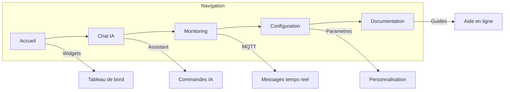
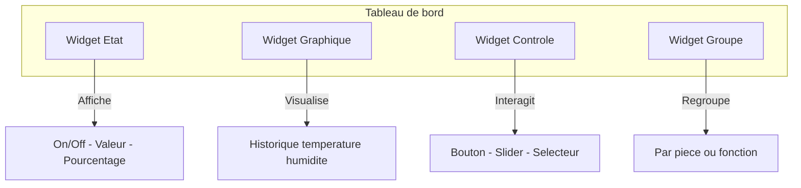
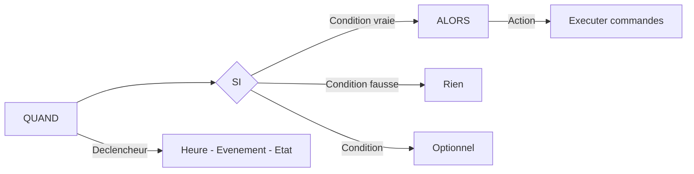
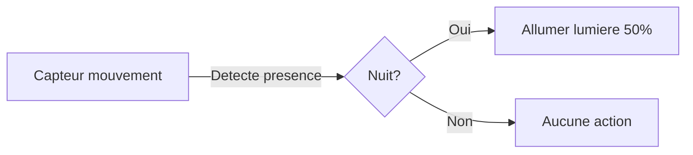

# Guide Utilisateur NeurHomIA

> **Version** : 1.0.0 | **Mise à jour** : 2026-03-09T10:00:00

Bienvenue dans le guide utilisateur de NeurHomIA, votre assistant domotique intelligent.

## 🏠 Vue d'ensemble

NeurHomIA est une interface de gestion domotique qui vous permet de :
- Contrôler vos appareils connectés (lumières, volets, capteurs, etc.)
- Créer des scénarios d'automatisation
- Surveiller votre habitat en temps réel
- Personnaliser votre tableau de bord

---

## 🧭 Navigation dans l'interface

### Barre de navigation principale

L'interface est organisée autour d'une barre de navigation avec les sections suivantes :



| Icône | Section | Description |
|-------|---------|-------------|
| 🏠 | **Accueil** | Tableau de bord principal avec widgets |
| 💬 | **Chat IA** | Assistant conversationnel intelligent |
| 📊 | **Monitoring** | Surveillance des messages MQTT en temps réel |
| ⚙️ | **Configuration** | Paramètres et personnalisation |
| 📚 | **Documentation** | Guides et aide en ligne |

### Navigation clavier

- `Ctrl + K` : Ouvrir la recherche rapide
- `Ctrl + /` : Afficher les raccourcis clavier
- `Escape` : Fermer les fenêtres modales

---

## 📊 Tableau de bord

### Widgets disponibles

Les widgets sont des composants visuels interactifs :



#### 1. Widget État
Affiche l'état actuel d'un appareil (on/off, valeur, pourcentage).

#### 2. Widget Graphique
Visualise l'historique des données d'un capteur (température, humidité, etc.).

#### 3. Widget Contrôle
Permet d'interagir avec un appareil (bouton, slider, sélecteur).

#### 4. Widget Groupe
Regroupe plusieurs appareils par pièce ou fonction.

### Personnalisation du tableau de bord

1. Cliquez sur **Éditer** en haut à droite
2. Glissez-déposez les widgets pour les réorganiser
3. Redimensionnez en tirant les coins
4. Cliquez sur **Enregistrer** pour valider

---

## 💡 Contrôle des appareils

### Types d'appareils supportés

| Type | Exemples | Actions disponibles |
|------|----------|---------------------|
| **Lumières** | Ampoules, rubans LED | On/Off, luminosité, couleur |
| **Volets** | Volets roulants, stores | Ouvrir, fermer, position % |
| **Thermostats** | Chauffage, climatisation | Température cible, mode |
| **Capteurs** | Température, mouvement | Lecture seule |
| **Prises** | Prises connectées | On/Off |
| **Caméras** | Surveillance vidéo | Flux vidéo, détection |

### Contrôle rapide

- **Clic simple** : Basculer l'état (on/off)
- **Clic long** : Ouvrir le panneau de contrôle détaillé
- **Double-clic** : Accéder à l'historique

---

## 🤖 Assistant IA (Chat)

### Commandes vocales et textuelles

L'assistant comprend les commandes en langage naturel :

```
"Allume la lumière du salon"
"Ferme tous les volets"
"Quelle est la température de la chambre ?"
"Crée un scénario pour le matin"
```

### Historique des conversations

Les conversations sont sauvegardées et accessibles dans l'onglet **Historique**.

---

## 🔄 Scénarios d'automatisation

### Créer un scénario



1. Accédez à **Configuration > Scénarios**
2. Cliquez sur **Nouveau scénario**
3. Définissez les éléments :
   - **QUAND** : Déclencheur (heure, événement, état)
   - **SI** : Conditions optionnelles
   - **ALORS** : Actions à exécuter

### Exemple : Éclairage automatique



### Activer/Désactiver

Utilisez le bouton toggle pour activer ou désactiver un scénario sans le supprimer.

---

## 🏷️ Gestion des pièces et zones

### Organisation hiérarchique

```
Maison
├── Rez-de-chaussée
│   ├── Salon
│   ├── Cuisine
│   └── Entrée
├── Étage
│   ├── Chambre 1
│   ├── Chambre 2
│   └── Salle de bain
└── Extérieur
    ├── Jardin
    └── Garage
```

### Assigner un appareil à une pièce

1. Sélectionnez l'appareil
2. Ouvrez **Paramètres > Localisation**
3. Choisissez la pièce dans la liste

---

## 🎨 Personnalisation

### Thèmes

NeurHomIA propose plusieurs thèmes :

| Thème | Description |
|-------|-------------|
| **Clair** | Interface lumineuse, idéale le jour |
| **Sombre** | Réduit la fatigue oculaire |
| **Système** | S'adapte aux préférences de votre appareil |

### Changer de thème

1. Accédez à **Configuration > Apparence**
2. Sélectionnez votre thème préféré
3. Le changement est immédiat

### Personnalisation avancée

- Couleur d'accent personnalisée
- Taille de police ajustable
- Mode compact pour petits écrans

---

## 🔔 Notifications

### Types de notifications

| Niveau | Couleur | Usage |
|--------|---------|-------|
| **Info** | Bleu | Informations générales |
| **Succès** | Vert | Actions réussies |
| **Avertissement** | Orange | Attention requise |
| **Erreur** | Rouge | Problème à résoudre |

### Centre de notifications

Cliquez sur l'icône cloche 🔔 pour accéder à :
- Notifications récentes
- Historique complet
- Préférences de notification

---

## 📱 Utilisation mobile

### Interface responsive

L'interface s'adapte automatiquement à la taille de votre écran :
- **Desktop** : Tous les panneaux visibles
- **Tablette** : Navigation latérale repliable
- **Mobile** : Navigation en bas d'écran

### Application PWA

Vous pouvez installer NeurHomIA comme application :

1. Ouvrez NeurHomIA dans votre navigateur
2. Menu > "Ajouter à l'écran d'accueil"
3. L'application s'installe avec une icône dédiée

---

## ❓ FAQ Utilisateur

### Comment réinitialiser un widget bloqué ?

1. Clic droit sur le widget
2. Sélectionnez **Actualiser**
3. Si le problème persiste, supprimez et recréez le widget

### Mes scénarios ne s'exécutent pas, que faire ?

1. Vérifiez que le scénario est **activé**
2. Contrôlez les conditions (heures, états)
3. Consultez **Monitoring > Logs** pour les erreurs

### Comment sauvegarder ma configuration ?

Accédez à **Configuration > Sauvegardes** pour exporter vos paramètres.

---

## 📞 Besoin d'aide ?

- **Documentation** : Consultez les guides dans l'onglet Documentation
- **Chat IA** : Posez vos questions à l'assistant
- **Administrateur** : Contactez votre administrateur système pour les problèmes techniques

---

*Guide Utilisateur NeurHomIA - Pour une maison intelligente et intuitive*
